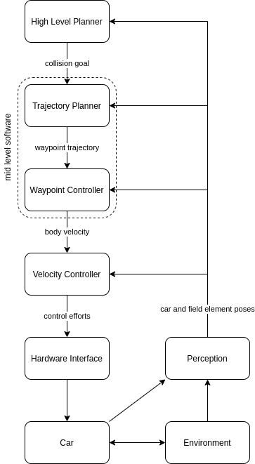

## Goal

Build a system of autonomous, scaled vehicles to play head-to-head in a game of high-speed soccer. Inspiration draws from the game, Rocket League, in which rocket-powered vehicles play soccer in 3v3 matches.

Future work may entail using the working system to launch a campus-wide competition. Here, students would have limited amount of time to build their own autonomous strategies and face-off in a tournament bracket.

## Current State

The components of the system have been outlined in order of abstraction:

<!-- TODO: include ROS graph -->

Each current status of each component is as follows.

### Car

The car is the complete physical system of one player on the field. Tests were performed on off-the-shelf cars, however none met the desired criteria for acceleration and control. To solve this issue, the team upgraded the electronics of the best-tested car and found the following results:

<figure class="video_container">
  <iframe src="https://drive.google.com/file/d/1hoZkHQMXcIDrOJjSXYIXwCfNXiyw8jH6/view?resourcekey" frameborder="0" allowfullscreen="true"> </iframe>
</figure>

> Left: upgraded car, middle & right: stock cars

The car's upgrades replaced: the servo motors, receiver, motor controller and battery.

<!--
TODO: include more info on car's specific upgrades
TODO: include picture of car's upgrades
-->

### Field

<!-- TODO: fill in section -->

### ROS Interface

<!-- TODO: fill in section -->

### Sensors

<!-- TODO: fill in section -->

### Low Level Controller

<!-- TODO: fill in section -->

### Localization

<!-- TODO: fill in section -->

### Waypoint Controller

The waypoint controller falls within a grouping of components known as the "midlevel software". Often these components are the glue between pure-software and hardware.

> For more info on midlevel software, follow up [here]()

This component is what commands the car to follow specific velocities and wheel angles. It accomplishes this by applying the [pure pursuit algorithm](https://www.mathworks.com/help/robotics/ug/pure-pursuit-controller.html#:~:text=Pure%20pursuit%20is%20a%20path,in%20front%20of%20the%20robot.&text=You%20can%20think%20of%20this,point%20in%20front%20of%20it.) on the path given by the trajectory planner.

### Trajectory Planner

<!-- TODO: fill in section -->

### Simulator

The simulator uses pybox2d. It allows us to test the high level planner, the Waypoint Controller, and the Trajectory Planner. The simulator subscribes to the car's target velocity (from the Waypoint Controller), and publishes car and field poses. It is considered part of the midlevel software.

> For more info on midlevel software, follow up [here]()

<!-- TODO: fill in section -->

### High Level Planner

<!-- TODO: fill in section -->

## Future work

<!-- TODO: fill in section -->

## Quick links

- [GitHub](https://github.com/purdue-arc/rocket_league)
- [Spring 2021 Presentation](https://drive.google.com/file/d/1zw7jYFSYIVamnQTyYaT1TCJGP7sZOg1J/view?usp=sharing)
