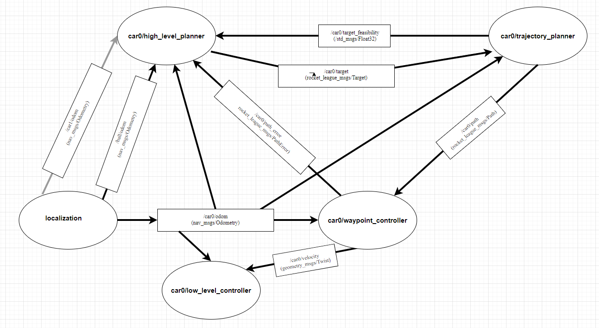
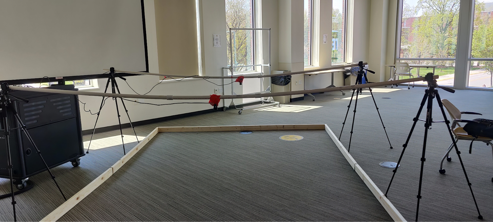
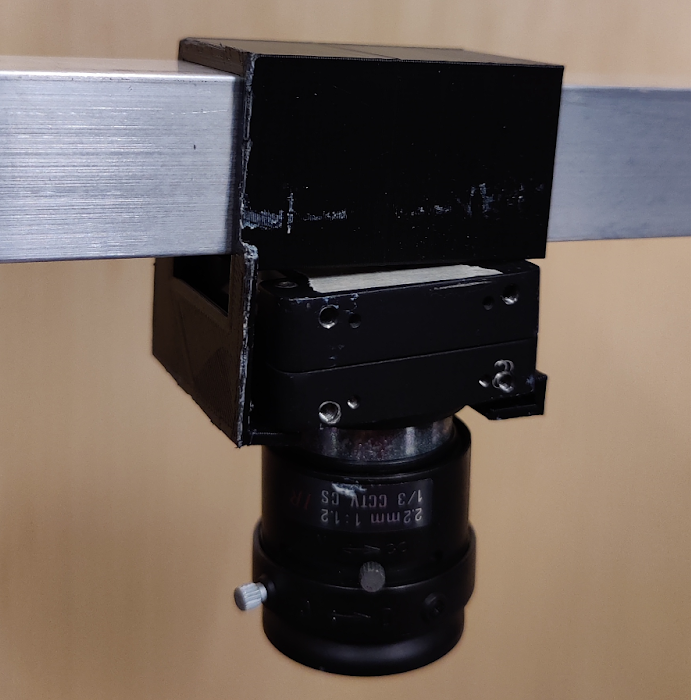
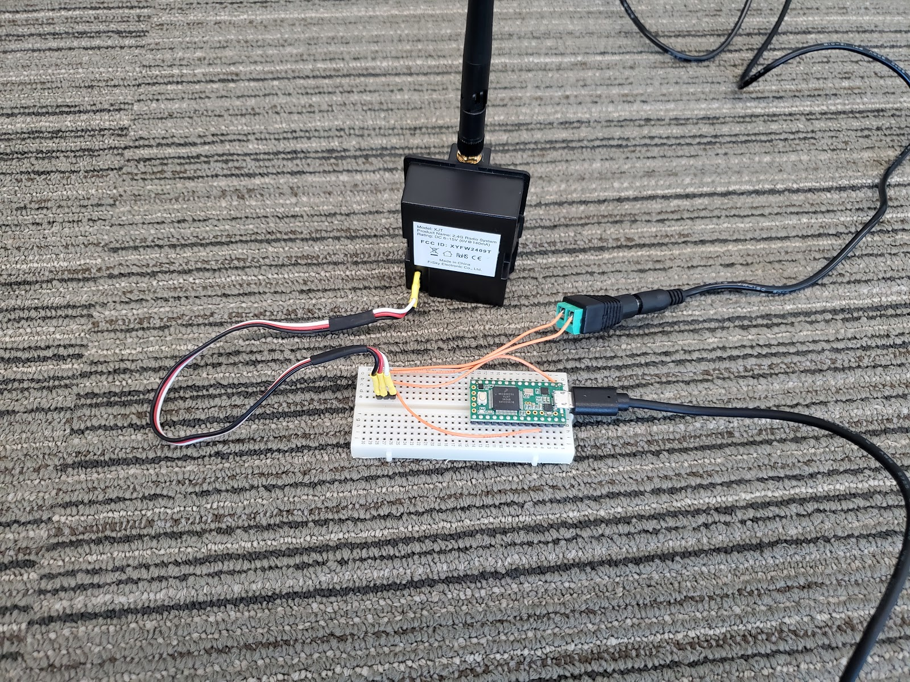

## Goal

Build a system of autonomous, scaled vehicles to play head-to-head in a game of high-speed soccer. Inspiration draws from the game, Rocket League, in which rocket-powered vehicles play soccer in 3v3 matches.

Future work may entail using the working system to launch a campus-wide competition. Here, students would have limited amount of time to build their own autonomous strategies and face-off in a tournament bracket.

## System Overview

The components of the system to reach our goal have been outlined in order of abstraction:

Each component falls into a particular grouping:
- Software (shown in orange)
- Hardware (shown in green)
- Localization (shown in yellow)

The above groupings define the subteams of the rocket-league project and enable parallel development.

> If you have vision processing experience, localization would likely be a good fit. Otherwise those with general programming experience are encouraged to work within software.

## Tools and Terminology

Rocket League is written in Python, using ROS to handle communication between each component.

> Documentation on setting up and learning about your ROS development evironment can be found [here]().

The following was created Spring '21 to detail our ROS network:

<!-- Introduce terminology such as diff for game and match in RL -->

## Current State

The current status of each component is as follows:

### Car

The car is the complete physical system of one player on the field. Tests were performed on off-the-shelf cars, however none met the desired criteria for acceleration and control. To solve this issue, the team upgraded the electronics of the best-tested car and found the following results:



> Left: upgraded car, middle & right: stock cars

The car's upgrades replaced: the servo motors, receiver, motor controller and battery.

<!--
TODO: include more info on car's specific upgrades
TODO: include picture of car's upgrades
-->

### Field Elements

Work has been done towards creating a consistent environment for operating the cars and providing infrastructure for localization.

In Spring 2021, physical tests were performed on Krach's carpet and used plywood planks to provide boundaries. Tripods with PVC tubes were also used to hold multiple cameras necessary for localization.

Future work intends on using aluminum square tubing to rigidly mount cameras with the addition of 3D printed mounts.

### ROS Interface

The ROS interface allows communication to occur between the ROS network and the RC car. 

Messages to the car are broadcasted using a FrSky XJT. These messages are passed by a Teensy 3.1 which communicates to the radio using digital PPM. ROS Serial is used to send the desired messages to be encoded to the Teensy from the ROS network.

An image of this setup is shown below:

### Low Level Controller

The low-level controller adjusts the commanded speed of car to match the desired output from the waypoint controller. To measure the error from the desired command, the low-level controller inputs data from localization.

### Localization

In order to capture the size of the operating field, multiple cameras are required.

<!-- Insert info about camera brand -->

Cameras are responsible for both tracking the pose + velocity of each car and the ball. Cars have been traditionally tracked through [AprilTags](https://april.eecs.umich.edu/software/apriltag#:~:text=AprilTag%20is%20a%20visual%20fiducial,tags%20relative%20to%20the%20camera.) and the ball through OpenCV color thresholding techniques.

Previous work demonstrated accurate tracking techniques on a single camera, but scaling this to two or more has proved a siginificant challenge due to processing speed. Future work should focus on finding solutions overcoming these scaling issues.

### Waypoint Controller

This component is what commands the car to follow specific velocities and wheel angles. It accomplishes this by applying the [pure pursuit algorithm](https://www.mathworks.com/help/robotics/ug/pure-pursuit-controller.html#:~:text=Pure%20pursuit%20is%20a%20path,in%20front%20of%20the%20robot.&text=You%20can%20think%20of%20this,point%20in%20front%20of%20it.) on the path given by the trajectory planner.

### Trajectory Planner

<!-- TODO: fill in section -->

### Simulator

The simulator uses pybox2d to create a virtual environment for testing the high-level planner, waypoint controller, and trajectory planner. It does this by suscribing to the car's target velocity (from the waypoint controller), and publishing car and field poses.

### High Level Planner

<!-- TODO: fill in section -->

## Future work

The team has outlined the following objectives in working towards the overall goal:
- Proving the high-level framework on snake game
- Testing and tuning of simulator for usage in training high-level planner
- Completion of camera mounting infrastructure
- Completion of field manufacturing

## Quick links

- [GitHub](https://github.com/purdue-arc/rocket_league)
- [Spring 2021 Presentation](https://drive.google.com/file/d/1zw7jYFSYIVamnQTyYaT1TCJGP7sZOg1J/view?usp=sharing)
